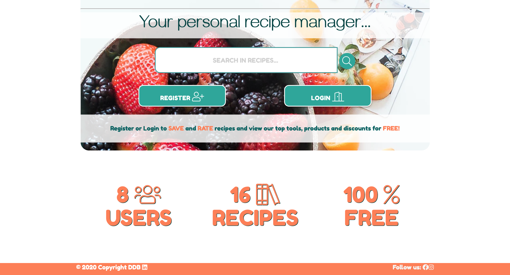

# **
RUBRIC <i  class="fas fa-hat-chef"></i>
** 

## WHAT IS RUBRIC
Rubric is an efficient personal recipe management web application.  It provides a full recipe management service, free of charge, that allows users to have access to a selection of recipes, including their own all in one place.
## WHAT DOES IT DO
It allows users to Create, Read, Update and Delete Recipe Documents. It also has features that allow registered users to save recipes they like and rate other peoples recipes. 

screenshot of landing page

## HOW IT WORKS FOR USERS
There are 2 stages of access

1. **Unregistered Access:** This allows users to view all recipes without being able to add, save or edit. It also limits their access to a products, tools and discounts page.
1. **Registered Access:** Once the user has logged in or registered, they can Create, Read, Update, Delete, Save and Rate recipes on the application. 
(*The user can only edit and delete their own recipes and can only rate the recipes of others*)

### QR CODE?

### **Creation and Design**

### **Behaviour Driven Development vs Test Driven Development or Acceptance Test Driven Development**

Due to the complexity of the application test driven development was paramount when developing the system. The behaviour needed to match the users needs but the functionality needed to pass essential tests to be a viable web application.

### **UX - STRATEGY:**

The application is designed to provide an essential service to users looking for an online recipe management system.

**_BUSINESS GOALS OF APPLICATION_**
- To provide an efficient recipe management web application
- To CREATE, READ, UPDATE and DELETE User Information
- To CREATE, READ, UPDATE and DELETE Recipe Information
- To CREATE, READ, UPDATE and DELETE Recipe Type Data
- To CREATE, READ, UPDATE and DELETE Product Information
- To CREATE, READ, UPDATE and DELETE Tool Information
- To PROMOTE recipe related Amazon products such as appliances and tools, to MONETIZE the application
- To direct online traffic and encourage shopping of sed products through the incentive of discounts 
- To generate a large user base to monetise the site through advertising by providing a free, useful and easy to use application

**_USER GOALS OF APPLICATION_**
- To CREATE and store a Recipe
- To READ / VIEW all recipes
- To UPDATE any recipe i created
- To DELETE any recipe i created
- To RATE other peoples recipes
- To SAVE other peoples recipes
- To READ / VIEW all recipes i have created
- To view recommended and recipe related tools and products
- To get discounts for products

**_WHO IS THE USER?_**

- The ideal user for Rubric:
  - Over the age of 10
  - Interested in Cooking and or Baking
  - Wants to cook more
  - Needs an online place to view and store recipes
  - Has disposable income for e-commerce

### **UX - SCOPE:**
**Business Intentions**

The Register/Log In feature is utilised in this application as it encourages data capture in exchange for added features free of charge. The added features that registering allow access to include:
- Saving Recipes to a private folder
- Rating recipes to give users feedback on their contributions
- Recommended Products and Tools page with prices, images and descriptions.
- Discounts for affiliate sites and products

Although registering is also free the user must give their full name and email address which has the scope in the future to be utilised for news, updates and marketing purposes.

**What do the NEW users want?**
- Users that are new to the application will want to navigate throughout the site easily and intuatively. They want to find and view recipes free of charge with the option of registering for the added features.

**What do the RETURNING users want?**
- Returning users want to log in easily to their profile on the application to use the application as a registered user with access to all features available.

**USER STORIES**`

1. As a new or returning user i want to navigate the application easily
1. As a new user i want the option to register to the site
1. As a returning user i want the option to login to the application
1. As a new or returning user i want to view all recipes on the application
1. As a new or returning user i want to easily search through all the recipes on the application
1. As a new or returning user i cant decide what recipe to view and want to be shown a random recipe to make my recipe choice experience fun and enjoyable
1. As a new or returning user i want to view all recipe types
1. As a new or returning user i want to view a recipe that is displayed clearly and makes my cooking experience easier
1. As a new or returning user i want to view all Vegan recipes 
1. As a registered user i want to add a recipe to the application
1. As a registered user i want to view all the recipes i have added/contributed
1. As a registered user i want to easily search through all recipes i have added/contributed
1. As a registered user i want to save recipes of other registered users
1. As a registered user i want to view all the recipes i have saved
1. As a registered i want to easily search through all the recipes i have saved
1. As a registered user i want to view cooking related products and tools recommended by Rubric
1. As a registered user i want to recieve discount codes for cooking related products

### **UX - STRUCTURE:**

The next plane to approach was Structure. What the application will do and and the external factors that might affect it.
This allowed an insight into the user experience and how a visitor uses the application.

**Here is the link to the structural sitemap:**
<a  href="https://github.com/DanielBradford/rubric/blob/793f1b03bbb0c314173efad35b1952d0630e94d5/documents/wireframes/Rubric%20Sitemap.pdf" target="_blank">SITEMAP</a>

**What does the application do/ How does it work?**

### **UX - SKELETON:**

The skeleton of this project was designed and established using Balsamiq (Cloud): https://balsamiq.cloud/

### **Wireframe Designs**

All wireframe designs can be found here:
<a href="#">Wireframe Designs</a>

### **UX - SURFACE:**

The final element to consider was the surface plane of UX design. This is the look and feel of the application.
Below are some screen shots of the application in use:

## **Style / Theme**

- It was important to me that the application remained gender neutral in order to maximise potential user scope. Upon researching current applications it appears many have a feminine tone which might discourage male users. From the start i intended the site to be bright, fun and intuitive.
The main COLOR scheme used includes:
- **Coral** (#ff7e50)
- **Teal** (#00897b)
- **White** (#ffffff)
As the application is centered around recipes and cooking i used a Chef Hat Symbol as the maing logo.
The FONTS used were from Google Fonts:
- **Fredoka One**
- **Gayathri**
To maintain the idea of being approachable, bright and friendly i used supporting colors for icons and buttons:
- **Pink** (#e91f63)
- **Purple** (#9c27b0)
- **Yellow** (#fdd835)

This was maintained throught the application using a mix of customised CSS and Materialize framework.

## **Main Page**

## **Features**

### **Repeating Features**

### The following features are repeated across the game/website allowing a consistent design format for the user to feel comfortable and familiar;

**Header**

- **Title/Icon** is clearly displayed in a user-friendly and stylish format.
- **Menu/Navbar** is clear and accessible. When hovered over the links are highlighted.

**Main Area**

**Footer**

- **Social Media Icons:** These icons when clicked take the user (on a new page) to the corresponding website for that social media

## **Future Features**

## **Hardware Used**

- ### **MacBook Pro (Retina, 13-inch, Mid 2014)**

## **Technologies Used**

- ### **Gitpod** - https://gitpod.io/
- ### **HTML / HTML5**
  - Used to create the structure of the pages
- ### **CSS / CSS3**
  - Used to style the elements and customise layout. e.g. Color Schemes, design elements
- ### **Materialize (CSS & Javascript/JQuery)**
  - Used mainly for responsive design and layout. Other elements used were Tables and Modals
- ### **JQuery**
  - Used to enhance the interactivity
- ### **Font Awesome** - v5.10.0 https://fontawesome.com/
  - All icons used in this project were from Font Awesome
- ### **Python 3** - 
  - For all application functionality and databse interaction
- ### **Flask** - 
  - For all website functionality and python interaction
- ### **Mongo DB** - 
  - For all database functionality

- ### **Lighthouse Analytics** (DevTools)
  - This was used to analayse the performance, accessiblity, best practices and SEO scores of the site.
- ### **WAVE** - https://wave.webaim.org/ (Accessibility Testing)

## **Testing**

### Please refer to <a href="#" target="_blank">TESTING.md</a> for a full testing breakdown

## **Deployment**

This project was **developed** using a <a href="https://gitpod.io/" target="_blank">GITPOD IDE</a>, committed to git and pushed to <a href="https://github.com/" target="_blank">GitHub</a> using the built in terminal feature.

- To add:
  - git add "filename"
- To commit:
  - git commit "filename" -m "unique message for commit"
- To push:
  - git push

This project was **deployed** using HEROKU.

### **To run locally:**

To clone this project from GitHub:

1. Follow this link to the <a href="#" target="_blank">Project GitHub repository</a>.
1. Under the repository name, click **"Clone or download"**.
1. In the Clone with HTTPs section, copy the clone URL for the repository.
1. In your local IDE open Terminal/Git Bash.
1. Change the current working directory to the location where you want the cloned directory to be made.
1. Type git clone, and then paste the URL you copied in Step 3.
   - **e.g. "git clone https://github.com/DanielBradford/Rubric"**
1. Press _**Enter**_. Your local clone will be created.
1. To cut ties with this GitHub repository, type git remote rm origin into the terminal.

**Further reading and troubleshooting on <a href="https://help.github.com/en/github/creating-cloning-and-archiving-repositories/cloning-a-repository" target="_blank">cloning a repository from GitHub here.</a>**

## **Credits**

- Unsplash for Images

- Inspiration and Structural guidance for the README.md file was taken from:
    * https://github.com/AJGreaves/portrait-artist/blob/master/README.md
    * https://github.com/Code-Institute-Solutions/StudentExampleProjectGradeFive/blob/master/README.md
