# **
 Testing 
**

# Table of contents

1. <a href="#valid">Code Validation</a>
1. <a href="#nav">Navigation Testing</a>
1. <a href="#story">User Story Testing</a>
1. <a href="#crud">C.R.U.D Testing</a>
1. <a href="#js">Javascript / JQuery Testing</a>
1. <a href="#rating">User Features Manual Testing</a>
1. <a href="#form">Form Validation Testing</a>
1. <a href="#admin">Admin features Manual Testing</a>
1. <a href="#def">Defensive Programming Testing</a>
1. <a href="#flash">Flash Messages Testing</a>
1. <a href="#responsive">Responsive Design Testing</a>
1. <a href="#bugs">De-bugging</a>
1. <a href="#future">Future Issues</a>
1. <a href="#devtool">DevTool Testing</a>
1. <a href="#further">Further Testing</a>

**HTML VALIDATION** - https://validator.w3.org/

- All HTML written in this project has been submitted for validation via the above software.
- The only errors thrown were due to the validator not recognising Jinja Templates.
- I then inputted it using the apps URL address and all pages passed.

**CSS VALIDATION** - https://jigsaw.w3.org/css-validator/

There were 3 minor errors that were corrected during testing:

        commit 2c8e061905795040d61851ad483cc667bb5d6804
        Author: Daniel Bradford <danielbradford@hotmail.co.uk>
        Date:   Thu Sep 17 14:53:17 2020 +0000

        Minor alterations resulted in passing jigssaw validation

- All CSS written in this project has been submitted for validation and passed via the above software.

**JAVASCRIPT VALIDATION** - https://jshint.com/

- ALL JS written in this project has been parsed through JSHint and no errors have been found.

        Metrics:
        There are 32 functions in this file. Function with the largest signature take 0 arguments, while the median is 0. Largest function has 33 statements in it, while the median is 2. The most complex function has a cyclomatic complexity value of 2 while the median is 1.

**PYTHON VALIDATION** - http://pep8online.com/

- ALL Python written in this project has been parsed  and linted using pep8 online and gitpod and no errors have been found. Upon scanning some lines of code needed to be shortened.

        commit 3c480c91bb56308f20ebc5e99f9db5a8fd71587a
        Author: Daniel Bradford <danielbradford@hotmail.co.uk>
        Date:   Wed Sep 16 18:55:00 2020 +0000
        Code layout cleaned to pass through pep8 validation

### **Navigation Testing**

- Mobile/Tablet Menu PASSED 
    - The hamburger menu icon is visible and functions
    - Appropriate links are shown/hidden depending on user
    - All text and icons are visible and appropriate sizes
    - All navigation links successfully direct the user to corresponding pages

- Desktop Menu PASSED 
    - All links highlight and apply intended CSS
    - Appropriate links are shown/hidden depending on user 
    - All text and icons are visible and appropriate sizes
    - All navigation links successfully direct the user to corresponding pages

- Floating Action Button Menu PASSED 
    - Menu successfully opens and closes on press/click
    - All buttons have clear icons
    - All buttons lead to corresponding pages

### **User Story Testing:**

1. As a new or returning user i want to navigate the application easily
   
    PASSED *The menu/nav bar functions for all screen sizes and the added floating menu enhances this experience. All navigation links successfully direct the user throughout the application*
1. As a new user i want the option to register to the site
    
    PASSED The registration page allows this. The functionality was tested by intentionally inputting data of various lengths and content. The registration validation passed this  manual test.
1. As a returning user i want the option to login to the application

    PASSED *The login page allows this. This was tested by intentionally inputting correct and incorrect usernames and passwords. The login validation passed this manual test.*
1. As a new or returning user i want to view all recipes on the application

    TESTING NOTE *A 'forgotten password" feature would be utilised in future.*

    PASSED *The view recipe page does this*
1. As a new or returning user i want to easily search through all the recipes on the application

    TESTING NOTE *Although the search function works, the function does not take errors or misspelling into account. This could be improved in the future by filtering in the back-end*

    PASSED *The search function operates successfully*
1. As a new or returning user i cant decide what recipe to view and want to be shown a random recipe to make my recipe choice experience fun and enjoyable

    TESTING NOTE *During testing the presentation of the random results could be clearer and display could be improved*

    PASSED *The random recipe button function accomodates this*

    
1. As a new or returning user i want to view all recipe types

    PASSED *Recipes Types are well displayed*
1. As a new or returning user i want to view a recipe that is displayed clearly and makes my cooking experience easier

     TESTING NOTE *All ingredient and method data is successfully processed and presented in the intended list format. The check boxes allow order and organisation for the user and is a helpful UX feature.*

    PASSED *The layout and design of the view recipe page does this*
1. As a new or returning user i want to view all Vegan recipes 

    TESTING NOTE *The presentation and focus of the results can be improved.*

    PASSED *The vegan filter button meets this requirement*
1. As a registered user i want to add a recipe to the application

     TESTING NOTE The data entry form was tested by inputting a variety of data sets that challended the length and content validation.

    PASSED *The add recipe functionality and validation works efficiently*
1. As a registered user i want to view all the recipes i have added/contributed

    PASSED *The 'my recipes' display and functionality works efficiently*
1. As a registered user i want to easily search through all recipes i have added/contributed

    PASSED *The search 'my recipes' functionality works efficiently*
1. As a registered user i want to save recipes of other registered users

    PASSED *The save recipe functionality works efficiently*
1. As a registered user i want to view all the recipes i have saved

    PASSED *The save recipe display works efficiently*
1. As a registered user i want to easily search through all the recipes i have saved

    TESTING NOTE If the user clicks back after the search the system is unable to provide a suitable page destination and crashes. THIS REMAINS UNFIXED

    PASSED *The search saved recipes functionality works efficiently*
1. As a registered user i want to view cooking related products and tools recommended by Rubric

    PASSED *The products and tools display page works efficiently*
1. As a registered user i want to receive discount codes for cooking related products.

    PASSED *The discount code modal functionality works efficiently*

### **CRUD FUNCTIONALITY TESTING**
CREATE:  PASSED
- All creation functionality for recipes, users, recipe types, products and tools was successful and reflected in the Mongo database

READ: PASSED
- All data was successfully presented to the user and is accurate to all data stored in the Mongo database 

UPDATE: PASSED
- All update functionality for editing recipes and users, was successful and the database stored the data accordingly 

DELETE: PASSED
- All functionality for deleting recipes, users, recipe types, tools and products was successful along with all Javascript confirmations.

### **JAVASCRIPT/JQUERY INTERACTIVITY TESTING** PASSED

ALL Javascript interactivity passed testing. This included:

- All MATERIALIZE javascript/JQUERY e.g. Modals & Navigation
- Toggles and Drop Downs
- Show/Hide functionality
- Delete Confirmations
- Copy to user device function (https://www.w3schools.com/howto/howto_js_copy_clipboard.asp)

### **DELETION CONFIRMATION TESTING**  (Javascript)  PASSED
All Javascript Confirm functionality was used to prevent user error. This was tested by trying to delete a record without having to confirm.

On every test the user had to confirm before deletion.

This failed once on the management page but was corrected.

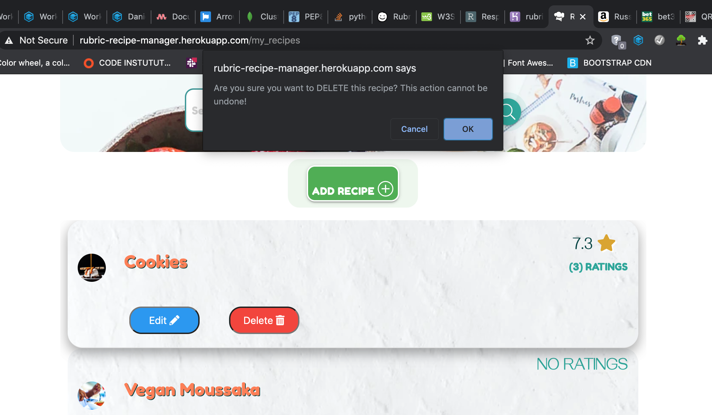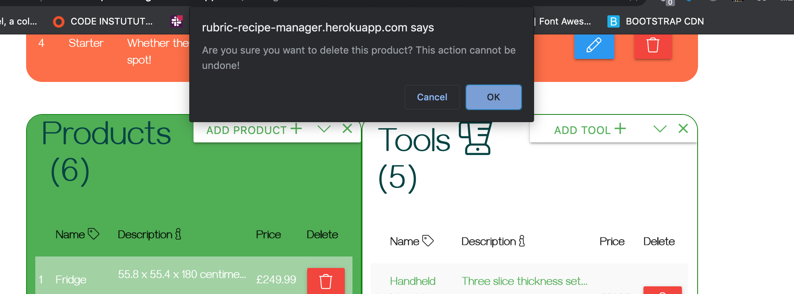

### **SEARCH FUNCTIONALITY** PASSED
In addition to testing the individual search functions to ensure they return and display the correct results, i also tested the outcome if **no results** were found. 

I created catch messages for this instance and they work correctly. 

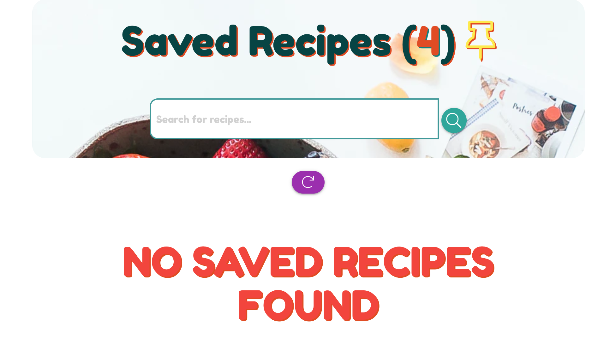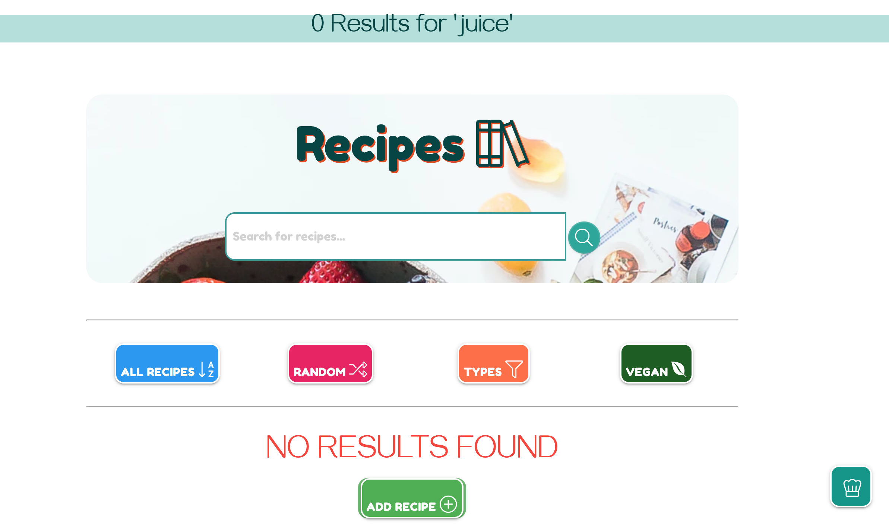

### **RATING FUNCTIONALITY** PASSED
One of the main features that needed to be tested was the rating system. This system allows the user to rate a recipe between 1 and 10 using a slide bar. The rating is then stored in an array in the recipe document. On the front-end the code generates the sum of the array and divides it by the length of the array giving the average rating for that recipe.

I tested this by logging in as different users and rating recipes to check the calculations were correct.

THERE IS CURRRENTLY NO LIMIT TO THE AMOUNT OF TIMES A USER CAN RATE THSE RECIPE. IN FUTURE THIS WILL BE LIMITED TO PREVENT ABUSE OF THIS FUNCTION. 

### **SAVE RECIPE FUNCTIONALITY** PASSED

- This involved logging in as a registered user and clicking the save option on the view recipe page for various recipes.
- The saved function passed this test by allowing the ObjectId to be saved and recalled/displayed on the Saved Recipes Page.
- The removal of this saved recipe also passed testing.

### **DATA ENTRY FORM TESTING** PASSED

This included testing the front-end and back-end validation for:
- Add Recipe
- Add User
- Edit User

For the purpose of defensive programming i used back end verification as well as front end validation to help prevent user error and or malicious intent.

This was primarily checking that the input fields had been completed and were not empty as well as verifying that the input length was within the minimum and maximum allowance.

I tested this by doing the following:

- Leaving input fields blank
- Trying to submit a form with fields missing
- Trying to submit with incorrect email address format
- Trying to submit with input length of 200 character

All of the above tests passed as the forms did not allow me to proceed.

### **MANAGEMENT / ADMIN FEATURE TESTING**
- **C.R.U.D** FUNCTIONALITY FOR USERS, RECIPES, RECIPE TYPES, PRODUCTS AND TOOLS PASSED
- USER EMAIL MAILTO FUNCTIONALITY - This successfully opens a new email addressed to the corresponding user. PASSED
- INCREMENT/DECREMENT OF RECIPE TYPE COUNT - The result can be viewed either in the Admin Management Table or in the Mongo DB collection. PASSED

    Below is the code used:

            this_type = request.form.get("type")
            # increments recipe type count
            mongo.db.type.update({"type_name": this_type},
                                 {"$inc": {"count": 1}})

            types = mongo.db.recipes.distinct("type", {"_id": ObjectId(recipe_id)})
            #decrements recipe type count
            for i in types:
            mongo.db.type.update({"type_name": i},
                                 {"$inc": {"count": -1}})

- TEST RECIPE TYPE CANNOT BE DELETED IF A RECIPE EXISTS IN THAT TYPE PASSED

        commit b63a6bc3a52e2b0b83c6dd6f3bb70524b5cc0fcb

### **Defensive Programming** PASSED

All defensive programming works as expected and controls user access and passed all tests.

These tests included:
- Cross URL Manipulation
    - Copy and paste other usernames to access their profile **PASSED - User redirected and flash message displayed**
    - Paste 'products' to the end of the URL to access the products page **PASSED - User redirected and flash message displayed**
    - Paste in the 'Manage' to access Admin Management page **PASSED - User redirected and flash message displayed**
    - Paste Add to end of URL to access add page (members only) **PASSED - User redirected and flash message displayed**

For the purpose of access control i gave the visitor the default session username of "Guest". By doing this i was then able to control and manipulate the users access to various parts of the application.

For example:

        commit 6a427fc696ec7441ba8f935f4d0184e317f9a4cb

- This helps prevent non registered users  from accessing member only areas e.g. someone elses profile

        commit: 4f83b44abaf36a8ca2cc6231703d48c5b543f828

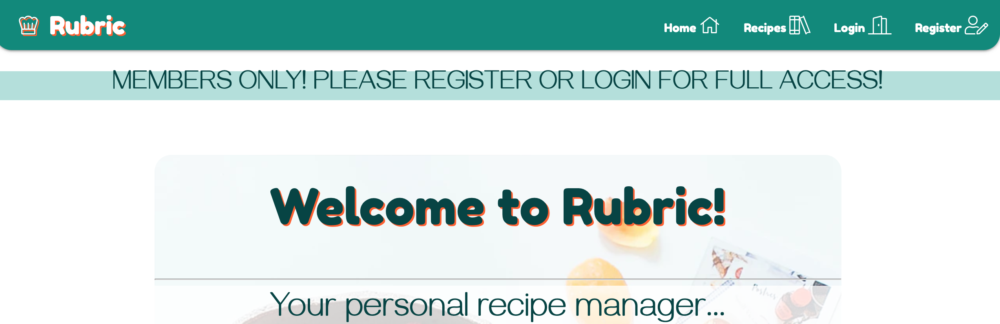

- This helps prevent users from editing or deleting recipes that were not their own
- This helps prevent non ADMIN users from accessing the management page.

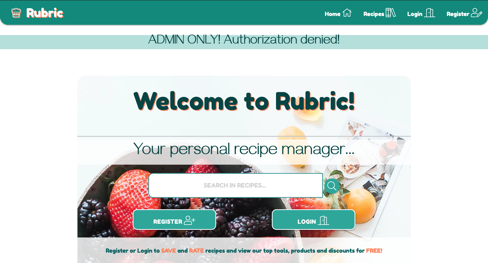
- This reduces the scope of malicious or damaging activity within the application

THIS CAN BE IMPROVED IN FUTURE DEVELOPMENT

**For example:**

To prevent users trying to view a recipe with a false code. I only allowed the standard Object ID length of 24 characters to be accepted.

    commit f20ef11bb8e2fdbc016d5626438a208a701cc066
    Author: Daniel Bradford <danielbradford@hotmail.co.uk>
    Date:   Thu Sep 17 16:30:03 2020 +0000

    View recipe defensive programming added. Checks recipe_id length to verify validity

This can be improved upon by cross checking the Object Id exists within the database before proceeding. This would be a good security feature to implement in the future.

### **FLASH MESSAGES** PASSED

Flash messages in this application inform the user of their succes and or errors.

ALL flash messages used in app.py are displayed clearly and correctly when required. 

These include:
- Form validation (Back-End) for correct password, input field lengths and content.

    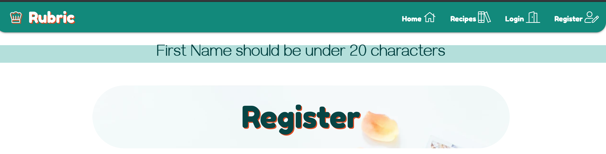
    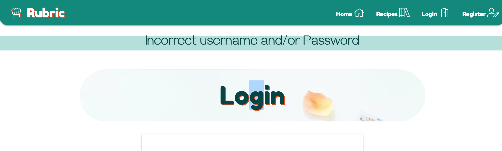

- Login (Welcome message) / Registration success - displayed when user has successfully logged in

    

- Logout - displayed when user has succes logged out

    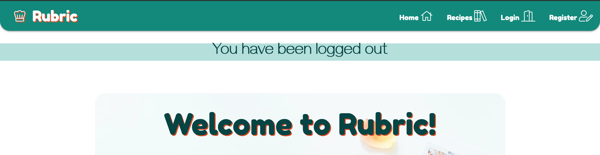

- Recipe Creation, Deletion, Saving and Editing success

    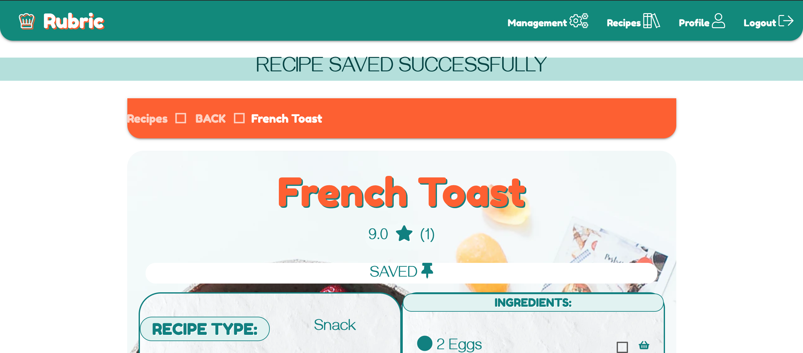
    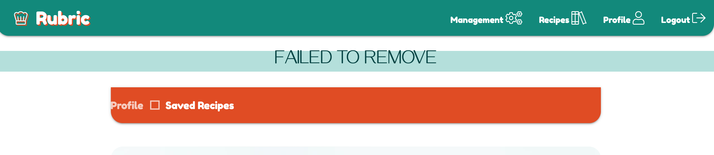

- Admin Only! Authorization Denied! - When user tries to access an admin only feature

    

- Members Only - When user tries to access a member only feature

    

## Responsive Design Testing PASSED

For final testing [Responsinator](https://www.responsinator.com/) was used to test the application accross multiple devices.

### Screen Size Testing/Compability

Screen Size         | Size              | Comments
--------------------|-------------------|---------
X-Small             | <768px            | No space between buttons for landing template. Grid layout altered to rectify PASSED
Small               | >=768px           | Landing page stats given flow-text attr. to prevent distortion PASSED
Medium              | >=992px           | Passed, no changes neccessary. PASSED
Large               | >=1200px          | Passed, no changes neccessary. PASSED

Commit Examples:

        commit 7a286130e0414e9703575ff7e0777cd1aafab062
        Author: Daniel Bradford <danielbradford@hotmail.co.uk>
        Date:   Thu Sep 17 15:44:48 2020 +0000

        Media query alterations for responsive design improvements

        commit 4bde74435aaea76484abec91143be5529c7485d2
        Author: Daniel Bradford <danielbradford@hotmail.co.uk>
        Date:   Thu Sep 17 15:26:32 2020 +0000

        Post testing alterations made to enhance responsive design

        commit d11bb2716f24a9fdf42574bf275a7490d0e563d2 (HEAD -> master)
        Author: Daniel Bradford <danielbradford@hotmail.co.uk>
        Date:   Thu Sep 17 13:37:02 2020 +0000

         Menu buttons spaced. Post testing resolve
### Browser Compability PASSED

Browser             | Version           | Comments
--------------------|-------------------|---------
Safari              | 12.0.2 (14606.3.4)| PASSED No errors observed
Firefox             | 80.0.1 (64-bit)   | PASSED No errors observed
Chrome              | 84.0.4147.105     | PASSED No errors observed

## **Development Issues / De-bugging:**

**Registration Bug:** When trying to apply defensive programming i blocked out the users option to register. I fixed this by removing uneccesary user filtering.

    Registration bug fixed. Overly defensive programming removed
    commit 1597d33a6d773432837b4944992968b58b464cab

**Add recipe Routing Bug:** After the floating menu was added i had incorrectly routed the add recipe template. This was fixed accordingly.

    commit 5453a8c314a786b6ef52de5221aaeef7e21bea5a

**Data Binding in Edit Recipe Form** A repeating bug was th inability to bind cooking time and temperature to the edit form to present the existing recipe information correctly. This was fixed by parsing the data into string format so it could be compared.

    commit 7a0c9c0baad9f6294d642e80e3c8f9cbbf07250a

## **Future Issues to be fixed**

- During development i encountered issues with the user session feature. When i a guest opens the application they are assigned a session['user] status as "Guest". This status allowed me to control their access throughout the application. This may have issues in the future if the application scope is to expand. 

- The edit recipe type function in the management suite is still in development. The issue is not how it operates but what way it can be presented to the user most efficiently. 

- After calling any search function there is a vulnerability if the user clicks the browsers back button. The form data is lost and crashes the application. THIS REMAINS UNFIXED

## **Development Tools Testing**

From using the technologies of Wave and Lighthouse i was able to check the performance and accessiblity of the website. By utilizing this in DevTools i was able to generate reports for both desktop and mobile.
By analysing these rerports i was able to make alterations in both the HTML and CSS code to improve the accessiblity of the application.

**Performance**

- In initial reports the website had an average Performance rating of **76**.
- I streamlined the style.css file to lessen the data being loaded. (commit git 
- By making these changes the current Performance rating is now (on average) **94**

**Accessibility**

- In initial reports the website had an average Accessibility rating of **78**
- I altered color schemes of text vs. background to maximise the contrast score allowing information to be more visible to a wider group of users with accessiblity issues.
- I added aria labels to enhance navigation accessiblity
- I resized icons and images to make them more visible
- By making these changes the current Performance rating is now (on average) **97**

**Best Practices**
- In initial reports the website had an average Best Practices Score of **84**
- I added meta tags, alt tags, and aria labels (commit f585fba139dd2c580b0b6aa071fee3e7c656a1ed)
- I corrected heading usage to ensure best practice was maintained
- By making these changes the current Best Practices rating is now (on average)**100**

**Search Engine Optimisation**

- In initial reports the website had an average SEO rating of **98**
- I added in some META tags to give more information about the websites content and creator.
- By making these changes the current SEO rating is now **100**

**Lighthouse Desktop Report:**
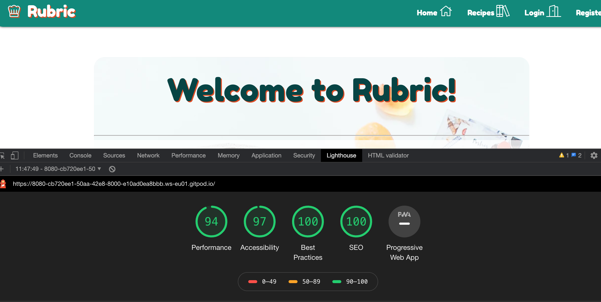
 

## **Further Testing**

I completed further testing by asking family and friends to use the application and give me feedback.
For example:

One user after testing advised the floating menu should have 'tool tips' to hint at the menu icon's function for new users.

        commit 6935a71fd5f9fe9ce3ff555068e16d9918539781 (HEAD -> master, origin/master, origin/HEAD)
        Author: Daniel Bradford <danielbradford@hotmail.co.uk>
        Date:   Mon Sep 21 16:13:14 2020 +0000

    Titles added to floating menu icons to inform user of their function when hovered over on desktop
This stage of testing allowed me to understand a more realistic client/user impression of the game and guided me to altering some functionality and stylistic choices. e.g. Future password retreaval system, bigger text in places and more breathing space between elements.